# Shopware C4 Context Diagram

This document contains the C4 Context diagram for the Shopware e-commerce platform, showing the system boundaries, external actors, and key integrations.

## Context Diagram

```mermaid
C4Context
    title Shopware E-Commerce Platform - System Context

    %% Users positioned around the center
    Person(customer, "Customer", "End user shopping online, browsing products, placing orders")
    Person(guest, "Guest User", "Anonymous visitor browsing products without account")
    Person(merchant, "Store Manager/Merchant", "Manages products, orders, customers, and store operations")
    Person(admin, "System Administrator", "Configures system, manages users, monitors performance")
    Person(editor, "Content Editor", "Creates and manages CMS content, media, SEO content")
    Person(support, "Customer Service", "Handles customer inquiries, processes returns/refunds")

    %% Central system
    System_Boundary(shopware, "Shopware E-Commerce Platform") {
        System(core, "Shopware Core", "E-commerce engine with product catalog, order management, customer management, and business logic")
    }

    %% External systems positioned around the center
    System_Ext(payment_gateway, "Payment Providers", "External payment processing (Stripe, PayPal, etc.)")
    System_Ext(shipping_provider, "Shipping Providers", "Delivery services (DHL, UPS, FedEx, etc.)")
    System_Ext(email_service, "Email Service", "SMTP servers for transactional and marketing emails")
    System_Ext(search_engine, "Elasticsearch", "Search indexing and product search capabilities")
    System_Ext(erp_system, "ERP/PIM Systems", "Enterprise resource planning and product information management")
    System_Ext(analytics, "Analytics Services", "Web analytics and customer behavior tracking (Google Analytics)")
    System_Ext(cdn, "CDN/Media Services", "Content delivery network and external media storage")
    System_Ext(marketplace, "App Marketplace", "Third-party apps and extensions ecosystem")
    System_Ext(webhook_consumers, "External Systems", "Third-party systems consuming Shopware business events")

    %% Customer interactions from top
    Rel(customer, core, "Browses products, places orders, manages account", "HTTPS/Store API")
    Rel(guest, core, "Browses products, makes purchases", "HTTPS/Store API")

    %% Internal user interactions from left side
    Rel(merchant, core, "Manages store operations", "HTTPS/Admin API")
    Rel(admin, core, "System configuration and monitoring", "HTTPS/Admin API")
    Rel(editor, core, "Content and media management", "HTTPS/Admin API")
    Rel(support, core, "Customer service operations", "HTTPS/Admin API")

    %% External system integrations - positioned radially around core
    Rel(core, payment_gateway, "Processes payments, handles refunds", "HTTPS/API")
    Rel(payment_gateway, core, "Payment status updates", "Webhooks")
    
    Rel(core, shipping_provider, "Shipping calculations, tracking", "HTTPS/API")
    Rel(shipping_provider, core, "Delivery status updates", "Webhooks")
    
    Rel(core, email_service, "Sends transactional emails", "SMTP")
    
    Rel(core, search_engine, "Product indexing and search queries", "HTTP/REST")
    
    Rel(erp_system, core, "Product data synchronization", "HTTPS/API")
    Rel(core, erp_system, "Order and inventory updates", "HTTPS/Webhooks")
    
    Rel(core, analytics, "Customer behavior and sales data", "HTTPS/API")
    
    Rel(core, cdn, "Media storage and delivery", "HTTPS/API")
    
    Rel(marketplace, core, "App installations and updates", "HTTPS/API")
    Rel(core, marketplace, "Usage metrics and billing", "HTTPS/API")
    
    Rel(core, webhook_consumers, "Business events (orders, customers)", "HTTPS/Webhooks")

    %% Layout positioning to center Shopware Core
    UpdateLayoutConfig($c4ShapeInRow="3", $c4BoundaryInRow="1")
    UpdateRelStyle(customer, core, $offsetY="-40", $offsetX="0")
    UpdateRelStyle(guest, core, $offsetY="-40", $offsetX="20")
    UpdateRelStyle(merchant, core, $offsetX="-40", $offsetY="-10")
    UpdateRelStyle(admin, core, $offsetX="-40", $offsetY="0")
    UpdateRelStyle(editor, core, $offsetX="-40", $offsetY="10")
    UpdateRelStyle(support, core, $offsetX="-40", $offsetY="20")
    UpdateRelStyle(core, payment_gateway, $offsetX="40", $offsetY="-30")
    UpdateRelStyle(core, shipping_provider, $offsetX="40", $offsetY="-10")
    UpdateRelStyle(core, email_service, $offsetX="0", $offsetY="40")
    UpdateRelStyle(core, search_engine, $offsetX="30", $offsetY="30")
    UpdateRelStyle(erp_system, core, $offsetX="-30", $offsetY="30")
    UpdateRelStyle(core, analytics, $offsetX="20", $offsetY="40")
    UpdateRelStyle(core, cdn, $offsetX="40", $offsetY="10")
    UpdateRelStyle(marketplace, core, $offsetX="-20", $offsetY="40")
    UpdateRelStyle(core, webhook_consumers, $offsetX="40", $offsetY="30")
```

## System Context Elements

### Primary System
- **Shopware Core**: The central e-commerce platform containing all business logic, APIs, and data management

### User Personas

#### External Users
- **Customer**: End users shopping online - browse products, place orders, manage accounts
- **Guest User**: Anonymous visitors - browse products, make purchases without registration

#### Internal Users  
- **Store Manager/Merchant**: Business users managing the store - product catalog, orders, customers
- **System Administrator**: Technical users - system configuration, user management, monitoring
- **Content Editor**: Content management users - CMS content, media library, SEO optimization
- **Customer Service**: Support staff - customer inquiries, returns, refunds

### External Systems

#### Core Service Providers
- **Payment Providers**: External payment processing (Stripe, PayPal, etc.)
- **Shipping Providers**: Delivery services (DHL, UPS, FedEx, etc.)
- **Email Service**: SMTP servers for transactional and marketing emails

#### Technical Infrastructure
- **Elasticsearch**: Search indexing and product search capabilities
- **CDN/Media Services**: Content delivery network and external media storage
- **Analytics Services**: Web analytics and customer behavior tracking

#### Enterprise Integration
- **ERP/PIM Systems**: Enterprise resource planning and product information management
- **External Systems**: Various webhook consumers for business events
- **App Marketplace**: Third-party apps and extensions ecosystem

## Relationship Patterns

### API-Based Interactions
- **Store API**: Used by customers and guests for storefront operations
- **Admin API**: Used by internal users for management operations
- **REST APIs**: Communication with external service providers

### Event-Driven Integration
- **Webhooks Inbound**: Payment and shipping status updates
- **Webhooks Outbound**: Business events sent to external systems
- **Business Events**: Order creation, customer registration, inventory changes

### Data Synchronization
- **Bidirectional**: ERP/PIM systems for product and inventory data
- **Unidirectional Outbound**: Analytics data, business events
- **Unidirectional Inbound**: Payment confirmations, shipping updates

## Key Architectural Characteristics

### Multi-Channel Support
- Traditional web storefront
- Headless commerce via Store API
- Admin management interface
- Mobile and third-party integrations

### Extensibility
- Plugin system for custom functionality
- App marketplace for third-party solutions
- Webhook system for external integrations
- Custom field and entity support

### Scalability Considerations
- API-first architecture supports horizontal scaling
- Event-driven design enables loose coupling
- External search engine for performance
- CDN integration for global content delivery

This context diagram provides the foundation for understanding Shopware's system boundaries and external dependencies, essential for planning a system rewrite or migration to another technology stack.